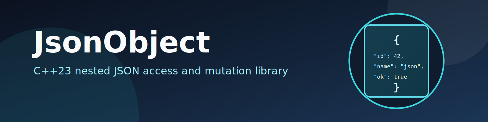

# JsonObject

`JsonObject` is a small C++ library built on top of Boost.JSON that makes nested JSON access and mutation easier via slash-separated key paths.

It supports:
- Object keys (`key/subKey`)
- Array indices (`list/[0]`)
- Special array symbols: `[^]` (first element/start insert) and `[$]` (last element/end append)
- Optional default values for safe `get(...)`
- Optional `force=true` in `set(...)` to create compatible intermediate containers
- File I/O helpers (`load(...)`, `write(...)`)

## What this repo does

This repository provides:
- The core library (`include/`, `src/`)
- Unit tests with GoogleTest (`test/`)
- CMake build/install setup for static library usage

The API is centered around:
- `util::JsonObject`
- `util::JsonKeyPath`
- JSON abstraction aliases/helpers in `include/json_types.h`

## Quick example

```c++
#include <dkyb/json_object.h>

using util::JsonObject;

JsonObject jsonObj(R"({"user":{"name":"Ada","scores":[1,2,3]}})");

jsonObj.set("user/name", "Ada Lovelace");
jsonObj.set("user/scores/[$]", 4);              // append
jsonObj.set("user/history/[0]/event", "created", true); // create missing structure

auto name = jsonObj.get("user/name");
auto last = jsonObj.get("user/scores/[$]");
```

## Key-path rules

- Use `/` to separate path segments.
- String keys must not be empty, must not be purely numeric, and must not contain `[`, `]`, `\n`, or `\r`.
- Array keys are bracketed: `[0]`, `[1]`, ...
- `[^]` means first element for `get(...)`, and insert-at-start behavior when setting at the target position.
- `[$]` means last element for `get(...)`, and append behavior when setting at the target position.

## Recent changes

Recent upstream/library changes include:
- Added compatibility checks when calling `get(path, defaultValue)` with incompatible path/container combinations.
- Added/amended support for special list symbols `[^]` and `[$]` for retrieval and mutation behavior.
- Added `load(filename)` and `write(filename, indent)` API for file-based JSON I/O.

Recent changes in this branch:
- Expanded unit tests to increase coverage for:
  - `JsonObject::get()` accessor and `clear()` behavior
  - `toString(indent)` compact vs pretty rendering paths
  - `get/set` overloads using `JsonKeyPath`
  - `set(...)` force and non-force error/compatibility paths
  - `load/write` failure handling for invalid paths
  - `JsonKeyPath` accessor/roundtrip behavior and slash-normalized parsing
  - `JsonIndexKey::getIndex(...)` behavior for `[0]`, `[^]`, `[$]`

## Build and test

### Dependencies
- CMake (>= 3.8)
- C++23 compiler
- Boost (>= 1.86.0, including Boost.JSON)
- GoogleTest

### Build

```bash
git clone --recurse-submodules -j "$(nproc)" git@github.com:kingkybel/JsonObject.git
cd JsonObject
cmake -S . -B build -DCMAKE_BUILD_TYPE=Debug
cmake --build build --parallel "$(nproc)"
```

### Run tests

```bash
./build/Debug/bin/run_tests
```

## Install

```bash
INSTALL_PREFIX=/usr
cmake -S . -B build -DCMAKE_BUILD_TYPE=Release -DCMAKE_INSTALL_PREFIX="${INSTALL_PREFIX}"
cmake --build build --parallel "$(nproc)"
sudo cmake --install build
```

Headers are installed to `${INSTALL_PREFIX}/include/dkyb` and the static library to `${INSTALL_PREFIX}/lib`.

## Powered by

Reduce the smells, keep on top of code-quality. Sonar Qube is run on every push to the `main` branch on GitHub.

[](https://sonarcloud.io/project/overview?id=kingkybel)
